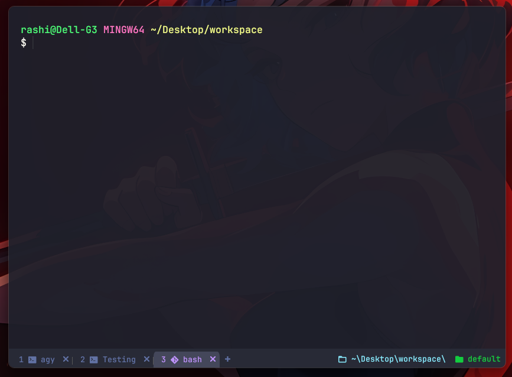

# WezTerm Configuration

A high-performance, aesthetically refined [WezTerm](https://wezfurlong.org/wezterm/) terminal configuration built for productivity, workspace management, and seamless visual harmony.



---

## 🔑 Keys & Keybindings

Below is the complete map of custom keyboard shortcuts configured in this setup.

### 👑 Leader Key
> **Leader Combination**: `Ctrl + A` (Timeout: 1000 ms)

| Shortcut | Action | Description |
| :--- | :--- | :--- |
| `Ctrl + A` | **Leader Prefix** | Press `Ctrl + A` followed by a key below within 1 second |

---

### 🪟 Pane Management & Navigation

| Shortcut | Action | Description |
| :--- | :--- | :--- |
| `Leader + H` | **Split Horizontal** | Split active pane horizontally in current domain |
| `Leader + V` | **Split Vertical** | Split active pane vertically in current domain |
| `Alt + ←` | **Focus Left** | Move cursor/focus to left pane |
| `Alt + →` | **Focus Right** | Move cursor/focus to right pane |
| `Alt + ↑` | **Focus Up** | Move cursor/focus to top pane |
| `Alt + ↓` | **Focus Down** | Move cursor/focus to bottom pane |

---

### 📑 Tab Management

| Shortcut | Action | Description |
| :--- | :--- | :--- |
| `Ctrl + Shift + T` | **New Tab** | Spawn a new tab in current domain |
| `Ctrl + Shift + W` | **Close Tab** | Close current tab (prompts confirmation) |
| `Ctrl + Shift + R` | **Rename Tab** | Open interactive input prompt to rename active tab |
| `Ctrl + Shift + F` | **Search** | Trigger terminal search for selection or empty string |

---

### 🗂️ Workspace Management

| Shortcut | Action | Description |
| :--- | :--- | :--- |
| `Ctrl + Shift + N` | **New Workspace** | Interactive prompt to create a new workspace window |
| `Ctrl + Shift + S` | **Switch Workspace** | Open interactive launcher to switch between active workspaces |
| `Ctrl + Shift + K` | **Kill Workspace** | Immediately terminate all tabs & panes in active workspace |

---

### 🛠️ System & Utilities

| Shortcut | Action | Description |
| :--- | :--- | :--- |
| `Ctrl + Shift + P` | **Command Palette** | Open WezTerm interactive command palette |
| `Ctrl + Shift + L` | **Debug Overlay** | Toggle WezTerm Lua debug overlay |

---

## 🎨 Features

- **Command Palette Customization**: Custom Dracula dark styling (`#21222c`), font size, and augmented quick-action items with Nerd Font icons for tab renaming, workspace switching, creation, and pane splitting.
- **Dracula Palette Integration**: Unified `#282a36` background color across tabs, window decorations, and main content area.
- **Dynamic Process Icons**: Auto-detects running process (`bash`, `pwsh`, `cmd`, `node`, `python`, `nvim`, etc.) and renders corresponding Nerd Font icons.
- **Path Formatting**: Automatically converts home directory paths to `~` and normalizes Windows drive letters.
- **Sound & Alert Behavior**: Auto-focuses window over screens on terminal bell and plays system sound.

---

## 🚀 Quick Start & Installation

1. **Clone the repository**:
   ```bash
   git clone https://github.com/Ra-Wo/wezterm-config.git
   ```

2. **Copy configuration to user home directory**:
   - **Windows (PowerShell)**:
     ```powershell
     Copy-Item -Path .\wezterm.lua -Destination $env:USERPROFILE\.wezterm.lua -Force
     ```
   - **Linux / macOS**:
     ```bash
     cp wezterm.lua ~/.wezterm.lua
     # or
     mkdir -p ~/.config/wezterm && cp wezterm.lua ~/.config/wezterm/wezterm.lua
     ```

3. **Reload**:
   WezTerm will automatically reload settings upon saving changes to `wezterm.lua`.
